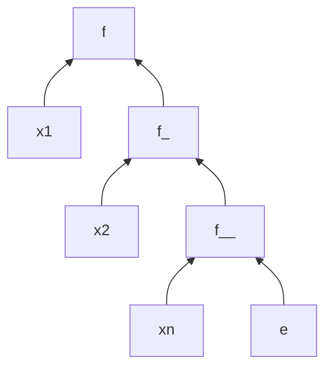

## Funzioni con più argomenti
In generale in ML ogni funzione ha un unico argomento. 
```sml
(*Date le funzioni*)
fun f (x, y) = ... (*L'argomento è una singola coppia*)
fun f x y = ...    (*L'argomento è x *)
(*--------------------------*)
- fun f (x, y) = x+y;
	> val f = fn: int*int -> int

- fun f' x y = x+y
	> val f'= fn : int -> int -> int (* il tipo int -> int -> int va inteso come 
																						int -> (int -> int) *)

- f (3,2);
	> val it = 5 : int

- f' 3 2;                (*Questa chiamata sarà interpretata come (f'3)(2) *)
> val it = 5 : int       (*Non mi è completamente chiaro*)

(*Otterremo un errore nei successivi casi*)
- f 3 2;
	> Error : operator and operand don ’ t agree
- f ’ (3 ,2);
	> Error : operator and operand don ’ t agree

(*Esempio di """puntatore a funzione"""*)
- val g = f' 3;
	> val g = fn : int -> int
(*Adesso g sarà una nuova funzione che prende un singolo argomento y e restituisce la somma di 3 e y.*)
- g 1;
	> val it =  4 : int
```

## Funzioni di ordine superiore

>[!note] 
> Sono le funzioni che prendono altre funzioni come parametri

Buona parte delle funzioni ricorsive operanti su liste, alberi, ecc, hanno la stessa struttura, l’unica cosa che cambia è l’operazione applicata ai nodi. È quindi abbastanza scrivere una volta per tutte la funzione che scandisce la struttura dati (che fa la funzione del ciclo e passargli la funzione da applicare ai nodi).

- Esempio
    
    ```sml
    - fun f g x = g(g(x));
    	> val f = fn : ('a -> 'a) -> a' -> a';
    ```
Tipologie di funzioni/ciclo più comuni:
- `filter`
- `map`
- `reduce`/`fold`

### `Filter`

>[!summary] 
>Fa parte della libreria standard `List.filter` 

Prende una funzione booleana f e una lista L e **seleziona gli elementi per cui la funzione f è vera.**
```sml
- fun filter f [] = []                                 (* Se la lista di input è vuota, restituisce una lista vuota *)
  |  filter f (x::y) = if f(x) then x::(filter f y)   (*Altrimenti, se il primo elemento della lista soddisfa il predicato f, lo aggiunge alla lista risultante *)
												else filter f y;                (* In qualsiasi altro caso esegue ricorsivamente la funzione filter sulla coda della lista (y) *)
```

```sml
- let
	  fun neg x = x < 0  (* Definizione della funzione "neg" che restituisce true se x è negativo *)
	in
	  filter neg [0, ~1, 3, ~2]  (* Applicazione della funzione "filter" alla lista [0, ~1, 3, ~2] utilizzando la funzione "neg" come predicato *)
end;
	val it = [~1, ~2]: int 
```

```sml
let
  fun pos x = x > 0  (* Definizione della funzione "pos" che restituisce true se x è positivo *)
in
  filter pos [0, ~1, 3, ~2]  (* Applicazione della funzione "filter" alla lista [0, ~1, 3, ~2] utilizzando la funzione "pos" come predicato *)
end;
```

### `Map`
> [!summary] 
> Fa parte della libreria standard `List.map`

Prende una funzione f e una lista l e applica f a tutti gli elementi della lista, ottenendo una nuova lista.

```sml
fun map f [] = []                     (* Se la lista di input è vuota, restituisce una lista vuota *)
| map f (x :: y) = f(x) :: (map f y)  (*Altrimenti applica la funzione f all'elemento x e lo aggiunge alla lista risultante,
																					 poi esegue ricorsivamente la funzione map sulla coda della lista (y) *)
```

```sml
- map real [1,2,3];
val it = [1.0, 2.0, 3.0] : real list
```

```sml
-map Int.toString [1,2,3];
val it = ["1","2","3"]: string list
```

### `Reduce`
>[!summary]
> La funzione `reduce` **serve per calcolare aggregati** di una lista

min, max, somma, prodotto, media

Prende in input una **funzione a 2 argomenti f:** un **valore finale e**  e una **lista L** ed effettua questo calcolo:

$$
reduce \ f \ e[x_1,x_2,\ldots,x_n] = f(x_1, f(x_2, \ldots f(x_n,e)\ldots))
$$

Per esempio, se f fosse `‘+’`, allora reduce calcolerebbe la somma degli elementi della lista.

```sml
fun reduce f e [] = e  (* Se la lista di input è vuota, restituisce 
													il valore iniziale e *)
| reduce f e (x :: y) = f(x, reduce f e y)  (* Applica la funzione f 
	all'elemento x e al risultato della riduzione della coda della lista *)
```

- Esempi
    
    ```sml
    (*Esempio SBAGLIATO somma (gli operatori come +, -, *, / non 
    possono essere passati come argomenti a una funzione come 
    reduce)*)
    - reduce + 0 [1 ,2 ,3];
    (*Esempio giusto*)
    - reduce (op +) 0 [,2,3];
    	> val it = 6 : int
    
    (*Esempio: media di [x1,...,xn] = x1/n + ... + xn/n*)
    - let 
    		fun f L (elem, accum) = elem / real(lenght L) + accum
    		val lista = [1.0,2.0,3.0]
    	in 
    		reduce (f lista) 0.0 lista
    	end;
    val it = 2.0 : real
    ```
    

La funzione reduce è molto simile alla funzione standard:


### Reduce generalizzata
$$ reduce (f \times l )= f(a_1, f(a_2, ..., f(a_n-1, f(a_n, x))...) $$

Alist è una list di A, in java sarebbe `List<A>`

$f: A \times A \rightarrow A$ $x \in A, \; l \in A \, list$

l’ordine di valutazione della reduce parte dall’ultimo valore (x) aggregandolo a tutti quelli della lista da destra a sinistra

$f(a, b) = a \; simbolo \; b$

`foldr` (r sta per right) è uguale ma più flessibile nei tipi

`foldl` (f sta per left) aggrega i valori della lista da sinistra verso destra, a differenza degli altri due

```sml
fun print_and_sum (a, b) = (
	print("(" ^ Int.toString(a) ^ ", " ^ Int.toString(b) ^ " ) -> "
				 ^ Int.toString(a+b) ^ "\\n");
	a+b;
);

val _ =
vabbuò po s ver
```
## `List.foldr`
`List.foldr f` e `1` restituisce $f(x_1, f(x_2, \ldots f(x_{n-1}, f(x_n, e))))$.

Su una lista vuota restituisce e. È una forma più generale di reduce perché f può accettare due tipi diversi: `f: 'a * 'b -> 'b`.

Il tipo di ritorno di List.foldr è `fn: ('a * 'b) -> 'b) -> 'b -> 'a list -> 'b`

## Funzioni anonime
Quando utilizziamo funzioni di ordine superiori può essere comodo passare a queste ultime delle funzioni semplici, fatte al momento che non abbiano bisogno di un nome (né un blocco `let`). Queste funzioni anonime si specificano con la keyword `fn`. La sintassi è la seguente

```sml
fn <Argomento> => <Espressione>
(* Esempi di utilizzo *)
- fn x => x+1;
	> val it = fn: int → int;
(* ---------------------------------------------------------------------------------------------------------------------------------------------------------*)
(* Sommare uno a tutti gli elementi della lista *)
- map (fn x => x+1) [1,2,3];
	>	val it = [2,3,4] : int list
(* Scartare tutti i numeri non pari di una lista *)
- List.filter (fn x => (x mod 2) = 0) [10,11,12,13];
	> val it = [10, 12]: int List.list;
```

Nei linguaggi Lisp, Scheme e anche Python l’equivalente di `fn` è la keyword `lambda`. In Java si chiama lambda-notation e si usa 
`->`: `s -> s.lenght()>10;`.