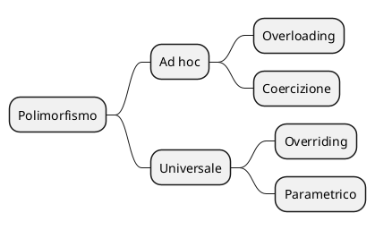

>[!summary] 
>Si parla di polimorfismo quando uno stesso oggetto sintattico appartiene a più tipi.


## Tipi di polimorfismo



### Ad hoc
>[!info] 
>Polimorfismo specifico per determinati tipi di dato, compresi alcuni predefiniti, si devono aggiungere singoli casi di polimorfismo ogni volta.

#### Overloading
Per overloading si intende il concetto che permette di definire più funzioni con lo stesso nome ma diversi tipi di parametri, questo permette di avere funzioni con stesso nome ma comportamenti diversi
>[!example] Prendiamo come esempio l'operatore `+`.
>`23 + 4` è una funzione di tipo `(int,int) -> int`, indica una somma tra interi che ritorna un intero
>`12.34 + 1.0` è di tipo `(double, double) -> double`, somma tra double
>`"abc" + "dE3"` è del tipo `(String, String) -> String`, è una concatenazione

#### Coercizione
La coercizione è la [[Cast#^2561af|promozione automatica]] di tipi.
>[!example] Operatore `+`
>`12.34 + 1` è una funzione del tipo `(double, int) -> (double, double) -> double
>Il secondo parametro viene convertito da `int` a `double` (`1` diventa `1.0`), in questo modo la funzione diventa una somma tra `double`, che restituisce un `double`.

### Universale
>[!info] 
>Polimorfismo che si applica a un numero di casi illimitato a priori.

#### Overriding
L'overriding è la "riscrittura" di un metodo ereditato da una classe padre in una classe figlia. Il metodo della classe figlia avrà stessa signature di quello della classe padre, ma un comportamento diverso.
>[!example] Esempio di overriding
>```Java
>class A{
>	void stampa(){
>		System.out.println("A");
>	}
>}
>class B extends A{
>	void stampa(){
>		System.out.println("B");
>	}
>}
#### Parametrico
Basato sui tipi parametrici: Generics, Templates.
##### Pro del polimorfismo parametrico
- Non necessita di controlli a runtime
- Anticipa la scoperta di errori a compile time
##### Pro del polimorfismo per inclusione
- Permette di definire strutture dati eterogenee